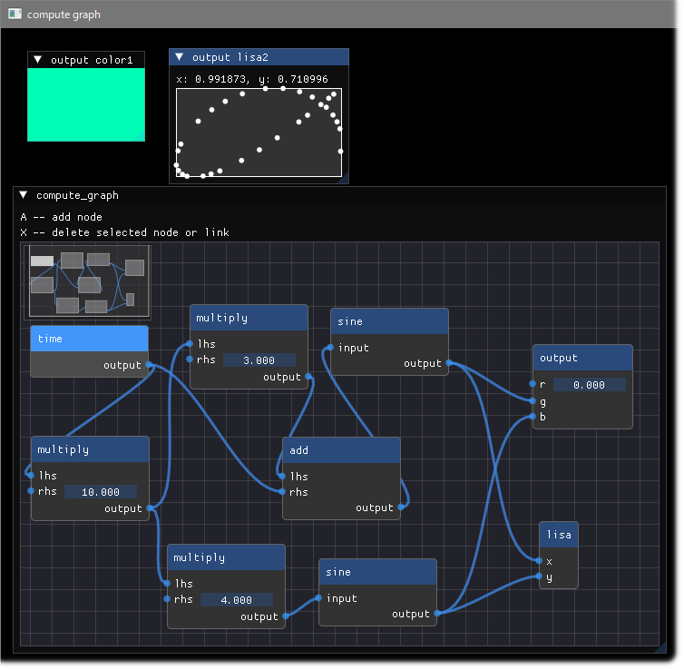

<!-- START doctoc generated TOC please keep comment here to allow auto update -->
<!-- DON'T EDIT THIS SECTION, INSTEAD RE-RUN doctoc TO UPDATE -->

- [LuaJITImGui](#luajitimgui)
  - [ImGui / CImGui Version](#imgui--cimgui-version)
  - [Examples](#examples)
    - [glfw_opengl3_simple](#glfw_opengl3_simple)
    - [glfw_opengl3](#glfw_opengl3)
    - [glfw_opengl3_implot](#glfw_opengl3_implot)
    - [glfw_opengl3_jp](#glfw_opengl3_jp)
    - [sdl2_opengl3](#sdl2_opengl3)
    - [ImGuizmo_sample.lua](#imguizmo_samplelua)
    - [imnodes_graph_sample.lua](#imnodes_graph_samplelua)
    - [delaunay_particles.lua](#delaunay_particleslua)
  - [Download Zip binary](#download-zip-binary)
  - [Running examples](#running-examples)
  - [Other examples](#other-examples)
  - [Build binaries from source](#build-binaries-from-source)
  - [My tools version](#my-tools-version)
  - [History](#history)
  - [Similar project ImGui / CImGui](#similar-project-imgui--cimgui)
  - [SDL Game tutorial Platfromer](#sdl-game-tutorial-platfromer)
  - [Other link2](#other-link2)

<!-- END doctoc generated TOC please keep comment here to allow auto update -->

### LuaJITImGui

---

- [LuaJIT](https://luajit.org/) + [ImGui](https://github.com/ocornut/imgui) : The binaries project on WindowsOS using [anima](https://github.com/sonoro1234/anima) project  
Differencies from [anima](https://github.com/sonoro1234/anima) project are as follows,
   1. Added compilation option for **IME (Imput method)**

      ```sh
      -DIMGUI_ENABLE_WIN32_DEFAULT_IME_FUNCTIONS
      ```

   1. Added compilation option for **ImPlot**

      ```sh
      -DImDrawIdx="unsigned int"
      ```

   1. Included newer [Font Awesome](https://fontawesome.com/search?m=free&o=r) Icon fonts.
   1. Added `*.bat` files to easily execute [example programs](bin/examples/LuaJIT-ImGui/examples). 
   1. Added `luajitw.exe` to hide console window on background.
   1. Added [simple examples](examples/) like [ImGuin](https://github.com/dinau/imguin) / [ImGuinZ](https://github.com/dinau/imguinz)  project.
- Support OS: Windows10 or later

#### ImGui / CImGui Version

---

- v1.91.6dock (2025/01)

#### Examples

---

##### [glfw_opengl3_simple](examples/glfw_opengl3_simple/glfw_opengl3_simple.lua)  


##### [glfw_opengl3](examples/glfw_opengl3/glfw_opengl3.lua)  

This can load and save image file with magnifying glass. 


##### [glfw_opengl3_implot](examples/glfw_opengl3_implot/glfw_opengl3_implot.lua)  

With magnifying glass.

  
See more example: [implot_sample.lua](bin/examples/LuaJIT-ImGui/examples/implot_sample.lua)

##### [glfw_opengl3_jp](examples/glfw_opengl3_jp/glfw_opengl3_jp.lua)  

Showing font of local language with magnifying glass.


##### [sdl2_opengl3](examples/sdl2_opengl3/sdl2_opengl3.lua)  

With magnifying glass.


##### [ImGuizmo_sample.lua](bin/examples/LuaJIT-ImGui/examples/ImGuizmo_sample.lua)

This sample is attached by [anima](https://github.com/sonoro1234/anima) project. You can execute this sample using
[ImGuizmo_sample.bat](bin/examples/LuaJIT-ImGui/examples/ImGuizmo_sample.bat)
in [bin/examples/LuaJIT-ImGui/examples](bin/examples/LuaJIT-ImGui/examples) folder.


##### [imnodes_graph_sample.lua](bin/examples/LuaJIT-ImGui/examples/imnodes_graph_sample.lua)

This sample is attached by [anima](https://github.com/sonoro1234/anima) project. You can execute this sample using
[imnodes_graph_sample.bat](bin/examples/LuaJIT-ImGui/examples/imnodes_graph_sample.bat)
in [bin/examples/LuaJIT-ImGui/examples](bin/examples/LuaJIT-ImGui/examples) folder.




##### [delaunay_particles.lua](bin/examples/delaunay_particles.lua)

This sample is attached by [anima](https://github.com/sonoro1234/anima) project. You can execute this sample,

```sh
pwd
luajitImGui-1.91.0.0
cd bin/examples
../luajit.exe delaunay_particles.lua
```


#### Download Zip binary

---

- WindowsOS 64bit  
- Latest  
[luajitImGui-1.91.6.0.zip](https://bitbucket.org/dinau/storage/downloads/luajitImGui-1.91.6.0.zip) 2025/01  

- Old  
[luajitImGui-1.91.4.0.zip](https://bitbucket.org/dinau/storage/downloads/luajitImGui-1.91.4.0.zip) 2024/10  
[luajitImGui-1.91.2.0.zip](https://github.com/dinau/luajitImGui/archive/refs/tags/1.91.2.0.zip) 2024/10  
[luajitImGui-1.91.1.0.zip](https://github.com/dinau/luajitImGui/archive/refs/tags/1.91.1.0.zip) 2024/09  
[luajitImGui-1.91.0.3.zip](https://bitbucket.org/dinau/storage/downloads/luajitImGui-1.91.0.3.zip)  
- WindowsOS 32bit last version  
[luajitImGui-1.91.0.2.zip](https://bitbucket.org/dinau/storage/downloads/luajitImGui-1.91.0.2.zip)  

#### Running examples

---

First on WindowsOS extract zip file downloaded then  
for instance,

```sh
cd luajitImGui-1.91.0.0
cd examples/glfw_opengl3
glfw_opengl3.exe         # or double click on Windows file explore
```

#### Other examples 

---

Refer to nice exmaples: [bin/examples](bin/examples)

#### Build binaries from source

---

- Prerequisites  
   Install at least on MSys2/MinGW console,

   ```sh
   pacman -S mingw-w64-ucrt-x86_64-{cmake,gcc,clang,llvm-openmp,patch} make
  ```

- Build **on MSys2 console**,

   ```sh
   git clone --recurse-submodules https://github.com/dinau/luajitImGui
   cd luajitImGui
   make clean
   make
   ```

   That's all :-)

#### My tools version

---

- Clang 19.1.6 (Current compiler)
   - Libraries: OpenMP 
- Gcc.exe (Rev1, Built by MSYS2 project) 14.2.0)
- (Microsoft Visual Studio 2022 C/C++)
- CMake version 3.30.3
- Git version 2.46.0.windows.1
- Make: GNU Make 4.4.1

#### History

---

- WindowsOS 64bit versions
   | Date    | ImGui / CImGui | LuaJITImGui | Commemt |
   | ---     | -----------    | ---         | ---     |
   | 2025/01 | v1.91.6        | v1.91.6.0   |         |
   | 2024/10 | v1.91.4        | v1.91.4.0   |         |
   | 2024/10 | v1.91.2        | v1.91.2.0   |         |
   | 2024/09 | v1.91.1        | v1.91.1.0   |         |
   | 2024/09 | v1.91.0        | v1.91.0.3   |         |

- WindowsOS 32bit versions
   | Date    | ImGui / CImGui | LuaJITImGui | Commemt                                                                                              |
   | ---     | -----------    | ---         | ---                                                                                                  |
   | 2024/08 | v1.91.0        | v1.91.0.2   |                                                                                                      |
   | 2024/07 | v1.90.9        | v1.90.9.0   |                                                                                                      |
   | 2024/06 | v1.90.8        | v1.90.8.0   |                                                                                                      |
   | 2024/05 | v1.90.7        | v1.90.7.0   |                                                                                                      |
   | 2024/05 | v1.90.6        | v1.90.6.2   |                                                                                                      |
   | 2024/03 | v1.90.4        | v1.90.4.0   |                                                                                                      |
   | 2024/02 | v1.90.1        | v1.90.1.3   | Added: Button "Save window image" and combo box, it can be saved as JPEG, PNG, TIFF, BMP file format |
   | 2024/01 | v1.90.1        | v1.90.1.0   | Added: Icon font demo                                                                                |


#### Similar project ImGui / CImGui

---

   | Language             |          | Project                                                                                                                                         |
   | -------------------: | :---:    | :----------------------------------------------------------------:                                                                              |
   | **Nim**              | Compiler | [ImGuin](https://github.com/dinau/imguin), [Nimgl_test](https://github.com/dinau/nimgl_test), [Nim_implot](https://github.com/dinau/nim_implot) |
   | **Lua**              | Script   | [LuaJITImGui](https://github.com/dinau/luajitImGui)                                                                                             |
   | **Zig**, C lang.     | Compiler | [Dear_Bindings_Build](https://github.com/dinau/dear_bindings_build)                                                                             |
   | **Zig**              | Compiler | [ImGuinZ](https://github.com/dinau/imguinz)                                                                                                     |
   | **NeLua**            | Compiler | [NeLuaImGui](https://github.com/dinau/neluaImGui)                                                                                               |
   | **Python**           | Script   | [DearPyGui for 32bit WindowsOS Binary](https://github.com/dinau/DearPyGui32/tree/win32)                                                         |

#### SDL Game tutorial Platfromer

---

   
   
   | Language             |          | Project                                                                                                  |
   | -------------------: | :---:    | :----------------------------------------------------------------:                                       |
   | **Nim**              | Compiler | [Nim-Platformer](https://github.com/dinau/nim-platformer)/ [sdl3_nim](https://github.com/dinau/sdl3_nim) |
   | **LuaJIT**           | Script   | [LuaJIT-Platformer](https://github.com/dinau/luajit-platformer)                                          |
   | **Nelua**            | Compiler | [NeLua-Platformer](https://github.com/dinau/nelua-platformer)                                            |
   | **Zig**              | Compiler | [Zig-Platformer](https://github.com/dinau/zig-platformer)                                                |
  

#### Other link2

---

- https://github.com/SpartanJ/SOIL2  
SOIL2 is a tiny C library used primarily for uploading textures into OpenGL. 
