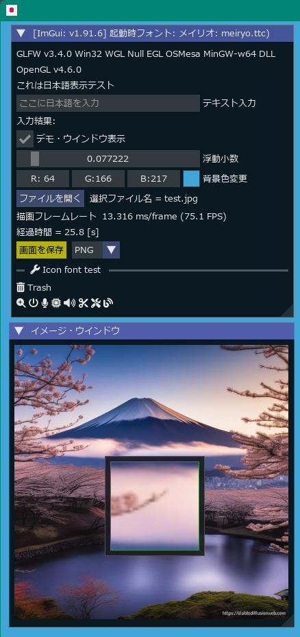

<!-- START doctoc generated TOC please keep comment here to allow auto update -->
<!-- DON'T EDIT THIS SECTION, INSTEAD RE-RUN doctoc TO UPDATE -->

- [LuajitImGui](#luajitimgui)
  - [Versions](#versions)
  - [Examples](#examples)
    - [glfw_opengl3](#glfw_opengl3)
    - [glfw_opengl3_implot](#glfw_opengl3_implot)
    - [glfw_opengl3_jp](#glfw_opengl3_jp)
    - [sdl2_opengl3](#sdl2_opengl3)
  - [Run examples](#run-examples)
  - [Other examples](#other-examples)
  - [History](#history)

<!-- END doctoc generated TOC please keep comment here to allow auto update -->

### LuajitImGui

---

- [Luajit](https://luajit.org/) + [ImGui](https://github.com/ocornut/imgui) : The binaries project on Windows OS using [anima](https://github.com/sonoro1234/anima) project  
Differencies from [anima](https://github.com/sonoro1234/anima) project are as follows,
   - Added GCC compilation options in [anima/Luajit-ImGui/CMakeLists.txt](anima/Luajit-ImGui/CMakeLists.txt)  
      1. For IME (Imput method)  
            `"-DIMGUI_ENABLE_WIN32_DEFAULT_IME_FUNCTIONS"`
      1. For ImPlot  
            `"-DImDrawIdx=unsigned int"`


- Added simple examples below like [imguin](https://github.com/dinau/imguin) project.

#### Versions

---

- ImGui v1.90.4 (2024/02)
- LuaJIT 2.1.1697887905 -- Copyright (C) 2005-2023 Mike Pall. https://luajit.o


#### Examples

---

##### [glfw_opengl3](examples/glfw_opengl3/glfw_opengl3.lua)  


##### [glfw_opengl3_implot](examples/glfw_opengl3/glfw_opengl3_implot.lua)  

  
See more example: [implot_sample.lua](bin/examples/LuaJIT-ImGui/examples/implot_sample.lua)

#####  [glfw_opengl3_jp](examples/glfw_opengl3_jp/glfw_opengl3_jp.lua)  



#####  [sdl2_opengl3](examples/sdl2_opengl3/sdl2_opengl3.lua)  


#### Running examples

---

On Windows OS first,

```sh
git clone https://github.com/dinau/luajitImGui
cd luajitImGui
```

For instance,

```sh
cd examples/glfw_opengl3
r.bat
```

#### Other examples 

---

Refer to nice exmaples: [bin/examples](bin/examples)

#### History

---
- 2024/03: Updated to ImGui v1.90.4
- 2024/02: Added: Button "Save window image" and combo box,  
it can be saved as JPEG, PNG, TIFF, BMP file format
- 2024/01: Added: Icon font demo
