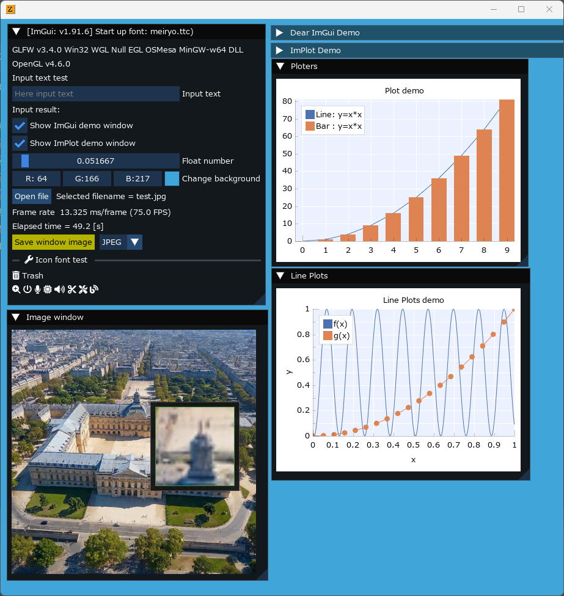

<!-- START doctoc generated TOC please keep comment here to allow auto update -->
<!-- DON'T EDIT THIS SECTION, INSTEAD RE-RUN doctoc TO UPDATE -->

- [LuajitImGui](#luajitimgui)
  - [ImGui / CImGui Version](#imgui--cimgui-version)
  - [Examples](#examples)
    - [glfw_opengl3_simple](#glfw_opengl3_simple)
    - [glfw_opengl3](#glfw_opengl3)
    - [glfw_opengl3_implot](#glfw_opengl3_implot)
    - [glfw_opengl3_jp](#glfw_opengl3_jp)
    - [sdl2_opengl3](#sdl2_opengl3)
  - [Running examples](#running-examples)
  - [Other examples](#other-examples)
  - [Build from source](#build-from-source)
  - [History](#history)
  - [Similar project](#similar-project)

<!-- END doctoc generated TOC please keep comment here to allow auto update -->

### LuajitImGui

---

- [Luajit](https://luajit.org/) + [ImGui](https://github.com/ocornut/imgui) : The binaries project on Windows OS using [anima](https://github.com/sonoro1234/anima) project  
Differencies from [anima](https://github.com/sonoro1234/anima) project are as follows,
   1. Added compilation option for **IME (Imput method)**

      ```sh
      -DIMGUI_ENABLE_WIN32_DEFAULT_IME_FUNCTIONS
      ```

   1. Added compilation option for **ImPlot**

      ```sh
      -DImDrawIdx="unsigned int"
      ```

   1. Included newer [Font Awesome](https://fontawesome.com/search?m=free&o=r) Icon fonts.
   1. Added simple examples like [imguin](https://github.com/dinau/imguin) project.
- Support OS: Windows10

#### ImGui / CImGui Version

---

- ImGui v1.90.9dock (2024/07)

#### Examples

---

##### [glfw_opengl3_simple](examples/glfw_opengl3_simple/glfw_opengl3_simple.lua)  


##### [glfw_opengl3](examples/glfw_opengl3/glfw_opengl3.lua)  


##### [glfw_opengl3_implot](examples/glfw_opengl3/glfw_opengl3_implot.lua)  

  
See more example: [implot_sample.lua](bin/examples/LuaJIT-ImGui/examples/implot_sample.lua)

#####  [glfw_opengl3_jp](examples/glfw_opengl3_jp/glfw_opengl3_jp.lua)  


#####  [sdl2_opengl3](examples/sdl2_opengl3/sdl2_opengl3.lua)  


#### Running examples

---

On Windows OS first,

```sh
git clone https://github.com/dinau/luajitImGui
cd luajitImGui
```

For instance,

```sh
cd examples/glfw_opengl3
r.bat
```

#### Other examples 

---

Refer to nice exmaples: [bin/examples](bin/examples)

#### Build from source

---

- Prerequisite
   - Clang 18.1.8 (Current compiler)
   - (Gcc.exe (Rev2, Built by MSYS2 project) 14.1.0)
   - (Visual Studio 2019 C/C++)
   - Cmake version 3.30.0-rc3
   - Git version 2.45.2.windows.1
   - Make: GNU Make 4.4.1
   - MSys/MinGW tools
   - Libraries: openMP ? etc
- Build

   ```sh
   git clone --recurse-submodules https://github.com/dinau/luajitImGui
   cd luajitImGui
   make
   ```

#### History

---

- 2024/07: Updated to ImGui v1.90.9
- 2024/06: Updated to ImGui v1.90.8
- 2024/05: Updated to ImGui v1.90.7
- 2024/05: Updated to ImGui v1.90.6
- 2024/03: Updated to ImGui v1.90.4
- 2024/02: Added: Button "Save window image" and combo box,  
it can be saved as JPEG, PNG, TIFF, BMP file format
- 2024/01: Added: Icon font demo


#### Similar project

---

| Language             | Project                                                                                                                                         |
| -------------------: | :----------------------------------------------------------------:                                                                              |
| **Nim**              | [ImGuin](https://github.com/dinau/imguin), [Nimgl_test](https://github.com/dinau/nimgl_test), [Nim_implot](https://github.com/dinau/nim_implot) |
| **Lua**              | [LuaJITImGui](https://github.com/dinau/luajitimgui)                                                                                             |
| **Python**           | [DearPyGui for 32bit WindowsOS Binary](https://github.com/dinau/DearPyGui32/tree/win32)                                                         |
| **Zig**, C lang.     | [Dear_Bindings_Build](https://github.com/dinau/dear_bindings_build)                                                                             |
| **Zig**              | [ImGuinZ](https://github.com/dinau/imguinz)                                                                                         |
